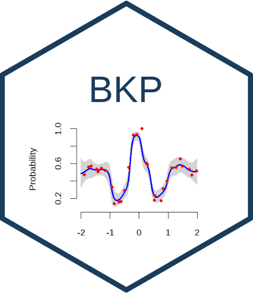

```{r, include = FALSE}
knitr::opts_chunk$set(
  collapse = TRUE,
  comment = "#>",
  fig.path = "man/figures/README-",
  out.width = "100%"
)
```

# BKP: Beta Kernel Process Modeling 

<!-- badges: start -->
[](https://deepwiki.com/Jiangyan-Zhao/BKP)
[](https://cran.r-project.org/package=BKP)

[](https://github.com/Jiangyan-Zhao/BKP/actions/workflows/R-CMD-check.yaml)
[](https://app.codecov.io/gh/Jiangyan-Zhao/BKP)
<!-- badges: end -->

**BKP** implements Beta Kernel Process models for nonparametric estimation of covariate-dependent binomial probabilities. The package uses kernel-weighted conjugate updates to obtain closed-form posterior inference for binary and aggregated binomial responses, avoiding latent-variable augmentation and MCMC-based computation.

The package also implements the **Dirichlet Kernel Process (DKP)** for categorical and multinomial responses, as well as scalable global-local approximations through **TwinBKP** and **TwinDKP**. These twin models combine twinning-selected global subsets with local nearest-neighbour updates to improve scalability for larger datasets.

## Features

- Bayesian-inspired kernel smoothing for binary, binomial, categorical, and multinomial data
- Closed-form posterior updates for BKP and DKP models
- Posterior prediction, credible intervals, fitted values, quantiles, and simulation
- Flexible kernel choices: Gaussian, Matérn 5/2, Matérn 3/2, and Wendland kernels
- Isotropic and anisotropic kernel hyperparameters
- LOOCV-based hyperparameter tuning with Brier score or log-loss
- Optional Shepard effective-sample-size calibration for BKP and DKP
- Scalable TwinBKP and TwinDKP approximations using twinning-based global-local updates
- S3 methods for `predict()`, `simulate()`, `summary()`, `plot()`, `print()`, `fitted()`, `parameter()`, and `quantile()`

## Installation

Install the stable version from [CRAN](https://CRAN.R-project.org/package=BKP):

```{r, eval=FALSE}
install.packages("BKP")
```

Install the development version from [GitHub](https://github.com/Jiangyan-Zhao/BKP):

```{r, eval=FALSE}
# install.packages("pak")
pak::pak("Jiangyan-Zhao/BKP")
```


## Quick example

```{r, eval = FALSE}
library(BKP)

set.seed(123)

true_pi_fun <- function(x) {
  (1 + exp(-x^2) * cos(10 * (1 - exp(-x)) / (1 + exp(-x)))) / 2
}

n <- 30
Xbounds <- matrix(c(-2, 2), nrow = 1)
X <- tgp::lhs(n = n, rect = Xbounds)

true_pi <- true_pi_fun(X)
m <- sample(100, n, replace = TRUE)
y <- rbinom(n, size = m, prob = true_pi)

fit <- fit_BKP(X, y, m, Xbounds = Xbounds)

summary(fit)
plot(fit)

Xnew <- matrix(seq(-2, 2, length.out = 100), ncol = 1)
pred <- predict(fit, Xnew = Xnew)
head(pred$mean)
```

For multinomial data, use `fit_DKP()`. For scalable global-local approximations, use `fit_TwinBKP()` or `fit_TwinDKP()`.

## Documentation


The statistical foundations, implementation details, and examples are described in

* [**BKP User Guide (PDF)**](https://arxiv.org/pdf/2508.10447)


## Citing

If you use **BKP** in your work, please cite both the methodology paper and the R package:

- **Methodology paper**  
  Zhao, J., Qing, K., and Xu, J. (2025). *BKP: An R Package for Beta Kernel Process Modeling.*  
  arXiv:2508.10447. <https://arxiv.org/abs/2508.10447>.

- **R package**  
  Zhao, J., Qing, K., and Xu, J. (2026). *BKP: Beta Kernel Process Modeling.*  
  R package version 0.3.0. <https://cran.r-project.org/package=BKP>.

You can also obtain the citation information directly within R:

```r
citation("BKP")
```

## Development

The BKP package is under active development. Bug reports, feature requests, and contributions are welcome through GitHub issues or pull requests:

- Issues: <https://github.com/Jiangyan-Zhao/BKP/issues>
- Pull requests: <https://github.com/Jiangyan-Zhao/BKP/pulls>

