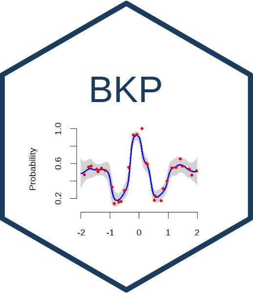

# BKP 

<!-- badges: start -->

<!-- badges: end -->

We present **BKP**, a user-friendly and extensible **R** package that
implements the **Beta Kernel Process (BKP)**—a fully nonparametric and
computationally efficient framework for modeling spatially varying
binomial probabilities. The BKP model combines localized kernel-weighted
likelihoods with conjugate beta priors, resulting in closed-form
posterior inference without requiring latent variable augmentation or
intensive MCMC sampling. The package supports binary and aggregated
binomial responses, allows flexible choices of kernel functions and
prior specification, and provides loss-based kernel hyperparameter
tuning procedures. In addition, BKP extends naturally to the **Dirichlet
Kernel Process (DKP)** for modeling spatially varying multinomial or
compositional data.

## Features

- ✅ Bayesian modeling for binomial and multinomial count data
- ✅ Kernel-based local information sharing
- ✅ Posterior prediction and uncertainty quantification
- ✅ Class label prediction using threshold or MAP rule
- ✅ Simulation from posterior (Beta or Dirichlet) distributions

## Documentation

The statistical foundations and example applications are described in
the following articles:

- [**Statistical
  background**](https://jiangyan-zhao.github.io/BKP/articles/BKP-intro.html)
- [**Examples**](https://jiangyan-zhao.github.io/BKP/articles/BKP-guide.html)

## Citing

If you use this package in your work, please cite the accompanying
methodology papers or package documentation.

## Development

The BKP package is under active development. Contributions and
suggestions are welcome via GitHub issues or pull requests.
